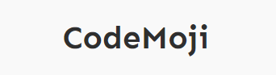
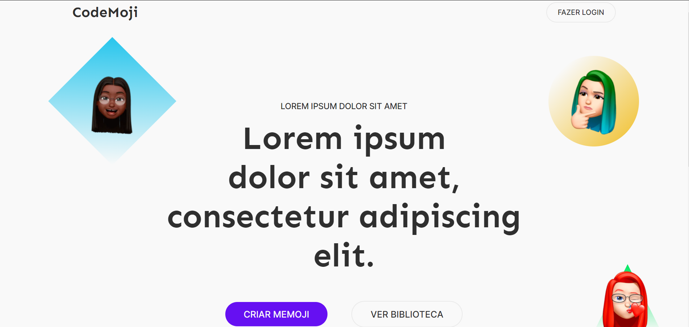

<h1 align="center">
    
</h1>

  

## 🧪 Tecnologias

Para o desenvolvimento deste site foram utilizadas as seguintes tecnologias:
- HTML
- SASS
## 💻 Projeto

Criação de um site semântico e responsivo sobre a criação de memoji´s. 

Este é um projeto desenvolvido a partir do desafio da comunidade [@Codelândia](https://discord.com/invite/QevDJqCzaY).

[**Clique aqui para vizualizar o projeto**](https://andrezafs.github.io/desafio-codelandia5/)

## 🔖 Layout
 Você pode visualizar o layout do projeto através dos links abaixo:

- [Layout Web](https://www.figma.com/file/Yb9IBH56g7T1hdIyZ3BMNO/Desafios---Codel%C3%A2ndia?node-id=11471%3A2)

Lembrando que você precisa ter uma conta [Figma](http://figma.com/) para acessá-lo.

## 🔨 Em Andamento

Em breve o layout estará totalmente responsivo!

## 📝 License

This project is licensed under the MIT License. See the [LICENSE](LICENSE.md) file for details.